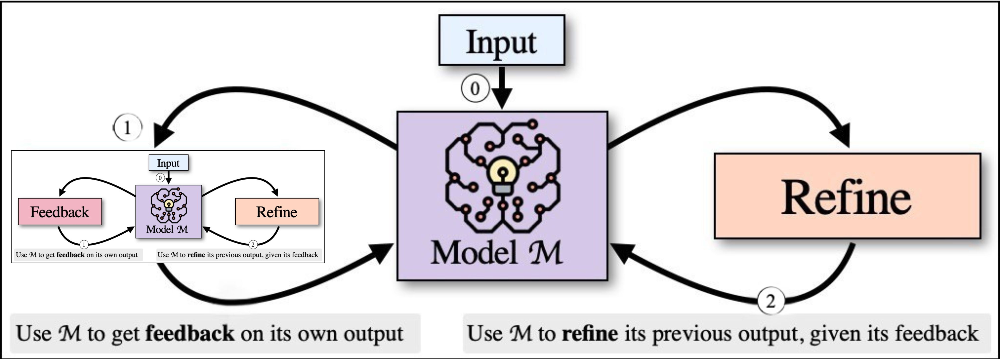

# NLP course final project: Refining Self-Refine



## Running Instructions

### Note
This script was run on a Windows OS environment. It might not work as expected in other operating systems without modifications.

### 1. Download Generated Test Cases
Download the generated test cases from the [pie-perf GitHub repository](https://github.com/madaan/pie-perf). Once downloaded, update the `inputs_outputs_basepath` field in the `perf_run_config.yaml` file to point to the path where the test cases are located.

### 2. Set OpenAI API Key
Set your OpenAI API key as an environment variable. Run the following command in your terminal:

```powershell
$env:OPENAI_API_KEY=<your api key>
```
Replace `<your api key>` with your actual OpenAI API key.

### 3. Run the Script
Run the `run_all.py` script using Python:

```powershell
python run_all.py --num_examples=1000 --model=gpt-4.1	
```

This will execute the script and save the results in the `run_all_results` directory.

### Output
The script will create a directory structure inside `run_all_results\<model>\<timestamp of run>` containing:
- A `result_summary.txt` file with final results and statistics.
- Logs from the run.
- Intermediate files.
